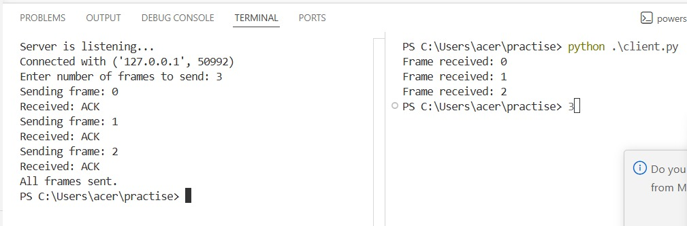

# 2b IMPLEMENTATION OF SLIDING WINDOW PROTOCOL
## AIM
To implement the Sliding Window Protocol in C/Python for reliable and efficient data transmission, ensuring proper flow control and error handling between sender and receiver by allowing multiple frames to be sent before requiring acknowledgment.

## ALGORITHM:
1. Start the program.
2. Get the frame size from the user
3. To create the frame based on the user request.
4. To send frames to server from the client side.
5. If your frames reach the server it will send ACK signal to client
6. Stop the Program
## PROGRAM
## server.py
 ```
import socket
s=socket.socket()
s.bind(('127.0.0.1',12345))
s.listen(5)
c,addr=s.accept()
size=int(input("Enter number of frames to send : "))
l=list(range(size))
s=int(input("Enter Window Size : "))
st=0
i=0
while True:
 while(i<len(l)):
  st+=s
  c.send(str(l[i:st]).encode())
  ack=c.recv(1024).decode()
  if ack:
   print(ack)
   i+=s
```
## client
```
import socket
s=socket.socket()
s.connect(('127.0.0.1',12345))
while True: 
 print(s.recv(1024).decode())
 s.send("acknowledgement received from the server".encode())
```

## OUTPUT


## RESULT
Thus, python program to perform stop and wait protocol was successfully executed
